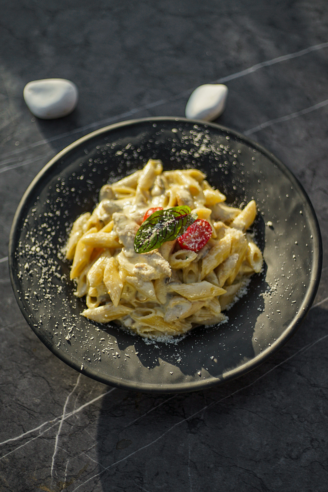

# 🍽️ Royal Bites Restaurant

A modern, responsive restaurant website built with HTML and CSS. The site includes multiple sections such as menu, gallery, reservation form, and embedded map for location – perfect for showcasing a real or concept restaurant.

---

## 📸 Preview

> _Insert screenshot or demo GIF here once hosted locally or online._

---

## 📂 Folder Structure

```

royal-bites/
│
├── index.html          # Main website file
├── 1.jpg               # Local image used for Alfredo Pasta
└── README.md           # Project documentation

````

---

## ✨ Features

- ✅ Responsive layout (mobile-first design)
- ✅ Hero banner with call-to-action
- ✅ Menu section with dish cards
- ✅ Gallery with food and ambiance photos
- ✅ Reservation form
- ✅ Google Maps embedded
- ✅ Clean UI with Poppins Google Font

---

## 🛠️ Technologies Used

| Technology     | Description                    |
|----------------|--------------------------------|
| HTML5          | Markup language for the web    |
| CSS3           | Styling and layout             |
| Google Fonts   | Font embedding (Poppins)       |
| Unsplash       | Free high-quality images       |
| Google Maps    | Location embedding             |

---

## 🚀 Getting Started

To run this project locally on your machine:

### 1. Clone the Repository

```bash
git clone https://github.com/yourusername/royal-bites.git
cd royal-bites
````

### 2. Add Local Image

Make sure to place your Alfredo Pasta image as `1.jpg` in the root directory (or rename it in the HTML file).

### 3. Open in Browser

Simply open the `index.html` file in any modern browser:

```bash
open index.html  # macOS
start index.html # Windows
```

Or double-click the file.

---

## 📷 Example Menu Item with Local Image

```html

```

> ⚠️ Ensure `1.jpg` exists in the same directory as `index.html`.

---

## 📬 Contact Info

**Royal Bites Restaurant**
📍 123 Foodie Lane, Bengaluru, India
📧 [info@royalbites.com](mailto:info@royalbites.com)
📞 +91 98765 43210

---

## 🔗 Live Demo

*Not yet deployed — you can host it using:*

* GitHub Pages
* Netlify
* Vercel
* Local server like VS Code Live Server

---

## 📄 License

This project is licensed under the **MIT License** – feel free to use and adapt it.

---

## 🙌 Acknowledgments

* [Unsplash](https://unsplash.com) – Free stock images
* [Google Fonts](https://fonts.google.com/) – Poppins font
* [Google Maps](https://maps.google.com/) – Map embedding

---

## 💡 Future Enhancements

* [ ] Add dark/light theme toggle
* [ ] Form validation and backend integration
* [ ] Animations and transitions
* [ ] SEO optimization

---

```

---

### ✅ What To Do With This?

- Save the content above as `README.md` in your project folder.
- Replace placeholders like `yourusername` and demo image paths when deploying.
- Use VS Code or any Markdown preview to see how it renders.

Let me know if you want this bundled into a `.zip` folder or pushed to GitHub.
```
